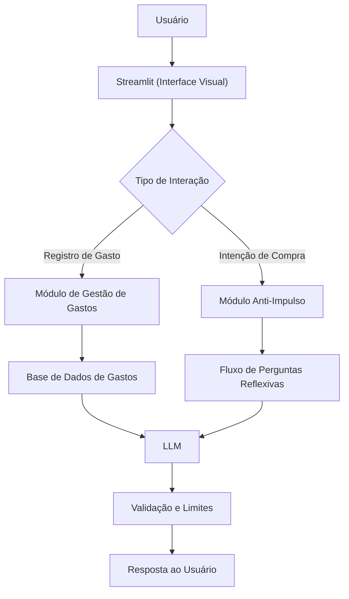

# Savi
Agente de controle de gastos financeiros e leve controle de compras por impulso

## 💡 O Que é o Savi?

Savi é um agente educativo que ajuda o usuário a registrar e acompanhar seus gastos, e que — antes de uma compra impulsiva — faz perguntas reflexivas para ajudar a pessoa a decidir com mais consciência. O Savi não julga nem proíbe: ele apenas convida o usuário a pensar antes de agir.

**O que o Savi faz:**
- ✅ Explica conceitos financeiros de forma simples
- ✅ Usa dados do cliente como exemplos práticos
- ✅ Responde dúvidas sobre produtos financeiros
- ✅ Analisa padrões de gastos de forma educativa
- ✅ Realiza perguntas reflexivas para gastos que parecem impulsivos

**O que o Savi NÃO faz:**
- ❌ Não recomenda investimentos específicos
- ❌ Não acessa dados bancários sensíveis
- ❌ Não substitui um profissional certificado
- ❌ Não proíbe nem reprova compras — apenas convida à reflexão

## 🏗️ Arquitetura



**Stack:**
- Interface: Streamlit
- LLM: Ollama (modelo local `deepseek-r1`)
- Dados: JSON/CSV mockados

## 📁 Estrutura do Projeto

```
├── data/                          # Base de conhecimento
│   ├── perfil_investidor.json     # Perfil do cliente
│   ├── transacoes.csv             # Histórico financeiro
│   ├── historico_atendimento.csv  # Interações anteriores
│   └── produtos_financeiros.json  # Produtos para ensino
│
├── docs/                          # Documentação completa
│   ├── 01-documentacao-agente.md  # Caso de uso e persona
│   ├── 02-base-conhecimento.md    # Estratégia de dados
│   ├── 03-prompts.md              # System prompt e exemplos
│   └── 04-metricas.md             # Avaliação de qualidade
│
└── src/
    └── app.py                     # Aplicação Streamlit
```

## 🚀 Como Executar

### 1. Instalar Ollama

```bash
Rode em um powershell ou um terminal;
irm https://ollama.com/install.ps1 | iex
ou
baixe o instalador no site ollama.com

#baixar o modelo 
ollama run deepseek-r1:latest
ollama serve
```

### 2. Instalar Dependências

```bash
pip install streamlit pandas requests
```

### 3. Rodar o Savi

```bash
streamlit run src/ia.py
```

## 🎯 Exemplo de Uso

**Pergunta:** "Vou comprar uma blusinha bonita de 50 reais, cabe no orçamento do mês?"  
**Savi:** "Hmm, que legal! Antes de confirmar essa compra, uma blusinha de 50 reais cabe no orçamento do mês! mas me conta uma coisa antes: você já tinha pensado nela antes, ou surgiu agora? seria uma compra impulsiva? "

**Pergunta:** "Onde estou gastando mais?"  
**Savi:** "Olhando suas transações de março, sua maior categoria foi moradia (R$ 1.350), seguida por alimentação (R$ 620) e transporte (R$ 210). Isso significa que moradia responde por X% do seu total — se quiser, posso calcular a porcentagem exata ou sugerir cortes. Deseja que eu faça a comparação mês a mês?"

## 📊 Métricas de Avaliação

| Métrica | Objetivo |
|---------|----------|
| **Assertividade** | O agente responde o que foi perguntado? |
| **Segurança** | Evita inventar informações (anti-alucinação)? |
| **Coerência** | A resposta é adequada ao perfil do cliente? |

## 🎬 Diferenciais

- **Personalização:** Usa os dados do próprio cliente nos exemplos
- **100% Local:** Roda com Ollama, sem enviar dados para APIs externas
- **Educativo:** Foco em ensinar, não em vender produtos
- **Seguro:** Estratégias de anti-alucinação documentadas

## 📝 Documentação Completa

Toda a documentação técnica, estratégias de prompt e casos de teste estão disponíveis na pasta [`docs/`](./docs/).
